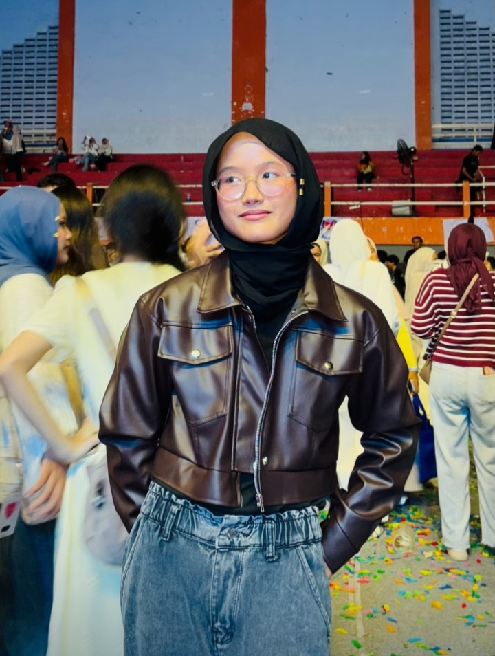
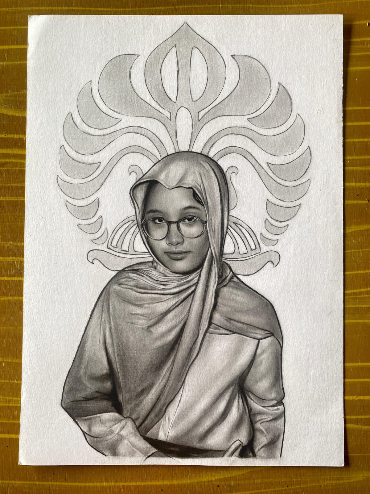

<!DOCTYPE html>
<html lang="id">
<head>
    <meta charset="UTF-8">
    <meta name="viewport" content="width=device-width, initial-scale=1.0">
    <title>Happy Birthday - Premium Cake with Dense Confetti</title>
    
</head>
<body>

    

        
MABA UI

        
MABA UI

        
MABA UI

        
MABA UI

        
MABA UI

        
MABA UI

    

    

        

        

        

        

        

        

        

        

        

        

        

        

        

        

        

        

        

        

    

    

        <h1>Selamat Ulang Tahun! ✨
         
(02-06-2026)

        </h1>

        

            

            

            

            

                

            

        

        
Denisa Alfia Rahma

        

            

                
                
✨ Semangat MABA UI Kriminologi

            

            

                
                
🤍 From me to you

            

        

    

</body>
</html>
